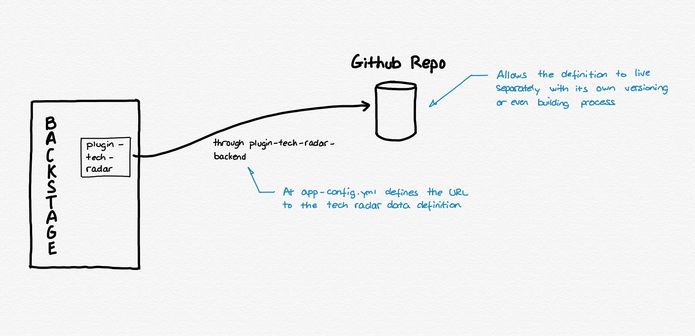

# [Backstage](https://backstage.io)

This is your newly scaffolded Backstage App, Good Luck!

To start the app, run:

```sh
yarn install
yarn dev
```

## Technology Radar plugin

Backstage offers a multitude of plugins, and one of them allows to have a Technology Radar a la ThoughtWorks.

### Installation and configuration

First, we need to install two plugins to make it work.

```shell
yarn --cwd packages/app add @backstage-community/plugin-tech-radar
```

Add the route to the `packages/app/src/App.tsx` file:

```typescript jsx
const routes = (
  <FloatRoutes>
    ...
    <Route
      path="/tech-radar"
      element={<TechRadarPage width={1500} height={800} />}
    />
  </FloatRoutes>
)
```

Also, you need to anchor a link to the sidebar, so change the `packages/app/src/components/Root/Root.tsx` file as:

```typescript jsx
export const Root = ({ children }: PropsWithChildren<{}>) => (
  <SidebarPage>
    <Sidebar>
      ...
      <SidebarGroup label="Menu" icon={<MenuIcon />}>
        ...
        <SidebarItem icon={HubIcon} to="tech-radar" text="Tech Radar" />
      </SidebarGroup>
    </Sidebar>
  </SidebarPage>
);
```

Now we want to be able to have our own data definition for the Technology Radar, so we will use a tech-radar-backend plugin for that.

```shell
yarn --cwd packages/backend add @backstage-community/plugin-tech-radar-backend
```



Using the `tech-radar-backend` plugin we are able to define at the configuration a URL where the JSON lives. So we can keep the technology radar content in a different repo or system, just referred at `app-config.yaml` with a block like:


```yaml
techRadar:
  url: https://github.com/ydarias/backstage-spike/blob/main/public/static/techRadarData.json
```

**Note**: Sometimes it takes a few minutes to reload the changes, give it a time before determining it is not working.

## Interesting links and documentation

* https://github.com/backstage/community-plugins/tree/main/workspaces/tech-radar/plugins/tech-radar
* https://github.com/backstage/community-plugins/blob/main/workspaces/tech-radar/plugins/tech-radar-backend
